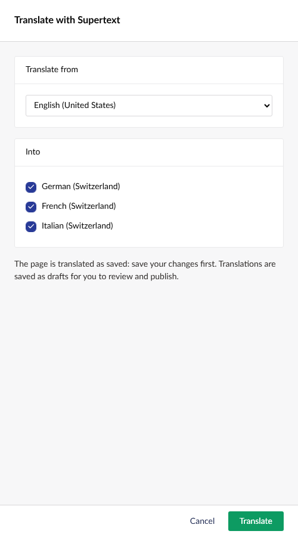

# Supertext Translation for Umbraco

Translate Umbraco pages into other languages with **Supertext AI**. Click **Translate with Supertext**, choose the languages, and Supertext translates the page name, text, rich text and the text inside block lists and block grids. The language versions are saved as drafts for you to review and publish.

Works with Umbraco 17 LTS (tested) and 18, .NET 10.



## How it works

1. An editor opens a page and clicks **Translate with Supertext** (next to *Save and publish*, or in the page's actions).
2. The page's language-specific fields are collected from the source language: text, rich text (formatting and links kept) and text inside blocks.
3. Each target language goes to Supertext as **one HTML document**, so a page with many blocks is a single round trip per language.
4. The translations are written to the target languages and saved as drafts, with the editor's permissions. Non-text fields are copied, so each language version is complete. Umbraco derives the language URL from the translated page name.

Languages that already have content are only replaced after a confirmation. If Supertext fails for a language, nothing changes for it, and the editor sees why.

## Documentation

| Guide | For |
| --- | --- |
| [Installation guide](docs/INSTALLATION.md) | Administrators: requirements, install, API key, languages, settings, troubleshooting |
| [User guide](docs/USER_GUIDE.md) | Editors: translating, reviewing, publishing, what gets translated |
| [Developer guide](docs/DEVELOPER.md) | Architecture, API protocol, local setup, tests, screenshots, demo deployment |

You need a Supertext account and API key: no account yet? [Create one at supertext.com](https://www.supertext.com/person/en/account/signin). Generate your API key at [supertext.com → Integrations → API](https://www.supertext.com/en/integrations/api) (requires the Admin role).

Quick start (not on NuGet yet — build the package first, see the installation guide):

```bash
dotnet add package Supertext.Umbraco.Translation
export SUPERTEXT_API_KEY=...        # or "Supertext": { "ApiKey": "..." } in appsettings.json
```

## Demo

`demo/` builds a container with Umbraco 17, the Clean starter kit in English, German, French and Italian (Switzerland), and this package. It's deployed to Railway on every push to `main` — details in the [developer guide](docs/DEVELOPER.md#demo-railway).

## Roadmap

See the [developer guide](docs/DEVELOPER.md#known-limitations--roadmap) and [CHANGELOG](CHANGELOG.md).

## License

MIT
