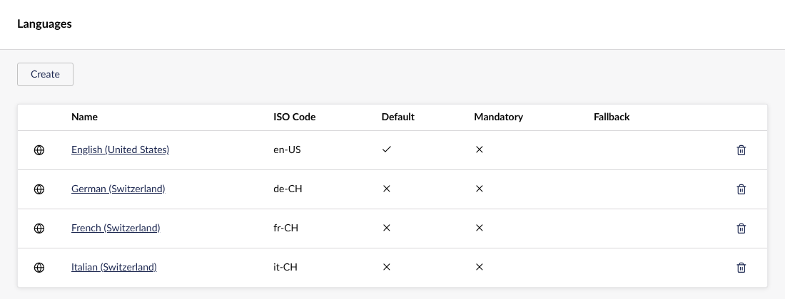
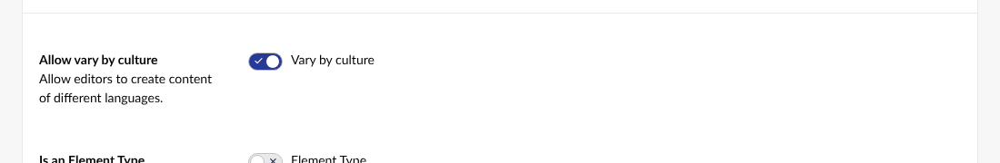
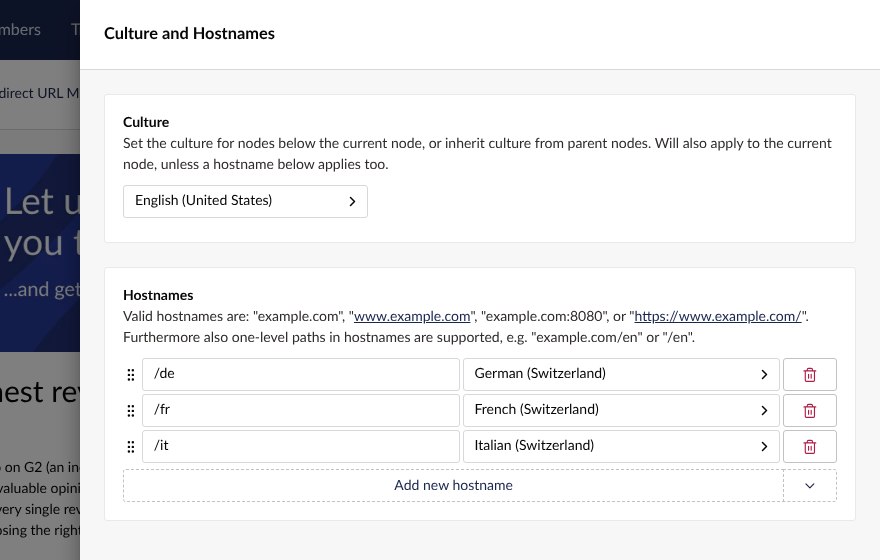

# Installation guide — Supertext Translation for Umbraco

For administrators setting up the package on an Umbraco site.

> **Just want to try it?** `demo/` contains a ready-to-run container with Umbraco 17, the Clean starter kit in English, German, French and Italian (Switzerland), and this package. It also runs the public Supertext demo. See the *Demo* section of the [developer guide](DEVELOPER.md#demo-railway).

## Requirements

| | |
| --- | --- |
| Umbraco | 17 LTS (tested), 18 (supported) |
| .NET | 10 |
| Languages | At least two languages, and document types that **vary by culture** |
| Supertext | An account with an API key — see [Set the API key](#2-set-the-api-key) |
| Network | The web server must reach `https://api.supertext.com` over HTTPS |

## 1. Add the package

The package is not on NuGet yet. Build it from the repository and add it from a local folder:

```bash
git clone https://github.com/Supertext/Umbraco-Supertext-Translation
dotnet pack Umbraco-Supertext-Translation/src/Supertext.Umbraco.Translation -c Release -o ./packages
# in your Umbraco project:
dotnet nuget add source /path/to/packages --name supertext-local
dotnet add package Supertext.Umbraco.Translation --version 0.1.0
```

(Or reference `src/Supertext.Umbraco.Translation/Supertext.Umbraco.Translation.csproj` from your solution.)

Restart the site. The package registers itself; there is nothing to enable in the backoffice.

## 2. Set the API key

Get the key first:

1. **Supertext account:** no account yet? [Create one at supertext.com](https://www.supertext.com/person/en/account/signin) (log in or create an account with your e-mail address).
2. **API key:** generate it at [supertext.com → Integrations → API](https://www.supertext.com/en/integrations/api). This requires the **Admin** role in your Supertext account; ask your Supertext account admin otherwise.

Then configure it, either:

- **Environment variable (recommended):** `SUPERTEXT_API_KEY=...`. It wins over the setting and keeps the key out of your repository.
- **appsettings.json:**

  ```json
  "Supertext": {
    "ApiKey": "..."
  }
  ```

Supertext shows the key as `Supertext-Auth-Key <key>`; paste it with or without that prefix. The dialog warns editors when no key is configured and links to the account signup and API key pages.

## 3. Languages

The package uses Umbraco's own multilingual setup:

1. **Settings › Languages:** add the languages you translate into.

   

2. **Settings › Document Types:** for each page type, enable **Allow vary by culture** (*Settings* tab), and on the properties that hold text, **Vary by culture**. Text in block lists is translated when the block list property varies by culture.

   

3. **Culture and Hostnames** on the home page (*Actions* ⋯): give each language a URL, e.g. `/de`, `/fr`, `/it`, or its own domain.

   

Turning on *Vary by culture* for a document type that already has content moves the values of its own properties to the default language. **Properties that come from a composition keep their old shared values**, which then no longer show. Re-save those pages in the default language, or move the values with a small migration; the demo does this in `DemoSetupService.MoveSharedValuesToEnglish`.

The package sends the Umbraco culture (ISO code) as the target language: `de-CH` stays `de-CH`. Per-language overrides are optional:

```json
"Supertext": {
  "Languages": {
    "de-CH": { "Code": "de-CH", "Politeness": "more" },
    "fr-CH": { "Code": "fr-CH", "Politeness": "more" },
    "en-GB": { "Enabled": false }
  }
}
```

`Politeness`: `more` = formal (Sie/vous/Lei), `less` = informal (du/tu), `default` = Supertext decides. `Enabled: false` hides a language from the dialog.

## Interface languages

The package's own screens (the **Translate with Supertext** button and menu entry, the dialog, its notifications and error messages) are in English, German, French and Italian. They follow each backoffice user's **UI Culture** (Users › the user, or the user's own profile: *UI Culture*); any regional variant (e.g. *Deutsch (Schweiz)*) uses its language, and other languages fall back to English. Nothing to configure.

## 4. Permissions

Editors need the **Update** permission on the page and access to the target languages (user group *Languages*, or *Allow access to all languages*). The default *Editors* group has both.

## 5. Check it works

Open a page, click **Translate with Supertext**, choose a language, and click **Translate** — see the [user guide](USER_GUIDE.md).

## All settings

All under `Supertext` in appsettings.json (or environment variables like `Supertext__PollTimeoutSeconds`):

| Setting | Default | |
| --- | --- | --- |
| `ApiKey` | `""` | API key; `SUPERTEXT_API_KEY` wins |
| `Endpoint` | `https://api.supertext.com/v1/` | API base URL; `SUPERTEXT_API_ENDPOINT` wins |
| `PollIntervalSeconds` | `2` | Seconds between status checks |
| `PollTimeoutSeconds` | `240` | Maximum seconds to wait for one language |
| `Languages.<culture>.Code` | the culture | Target code sent to Supertext |
| `Languages.<culture>.Politeness` | `default` | `more`, `less` or `default` |
| `Languages.<culture>.Enabled` | `true` | `false` hides the language from the dialog |
| `PlainTextEditors` | `Umbraco.TextBox`, `Umbraco.TextArea` | Property editors translated as plain text |
| `RichTextEditors` | `Umbraco.RichText`, `Umbraco.TinyMCE` | Translated as HTML, including blocks inside the rich text |
| `BlockEditors` | `Umbraco.BlockList`, `Umbraco.BlockGrid`, `Umbraco.SingleBlock` | Searched for translatable properties in their blocks |
| `ExcludedProperties` | `[]` | Property aliases never translated (copied as they are), e.g. `["code"]` for code snippets |

Values that are only a URL, e-mail address, path or number are never sent to Supertext.

## Updating

Build and add the new package version as in step 1, then restart the site.

## Uninstalling

```bash
dotnet remove package Supertext.Umbraco.Translation
```

Translations already made stay in place; they are ordinary Umbraco content.

## Troubleshooting

| Symptom | Cause / fix |
| --- | --- |
| The button doesn't appear | Hard-refresh the backoffice after installing. Check the user's Update permission on the page. |
| *No Supertext API key is configured* | [Generate a key](https://www.supertext.com/en/integrations/api) (Admin role required), set `SUPERTEXT_API_KEY` (or `Supertext:ApiKey`) and restart. |
| *Authentication failed* | Wrong or revoked key; paste it again (the prefix is optional) or [generate a new one](https://www.supertext.com/en/integrations/api). |
| *Too many requests* | Supertext's per-second limit; the package retries automatically (up to 4 times). |
| *Timed out waiting for the Supertext translation* | Very long pages; raise `PollTimeoutSeconds` (and proxy timeouts). |
| *does not vary by culture* | Enable *Allow vary by culture* on the document type (see *Languages*). |
| Translated page has no URL / 404 | Publish the parent pages in that language too, and set Culture and Hostnames. |
| A field isn't translated | Its property must vary by culture and use one of the editors above; check `ExcludedProperties`. |

Errors are logged with the prefix `Supertext:` (Settings › Log Viewer).

## Security note

The API key is read only from the environment or appsettings and sent only to the configured endpoint. The backoffice API checks the editor's Update permission for the document and target languages before translating.
