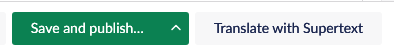
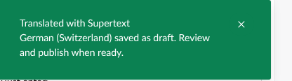
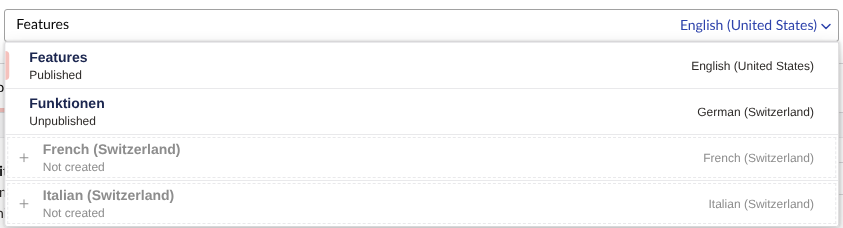
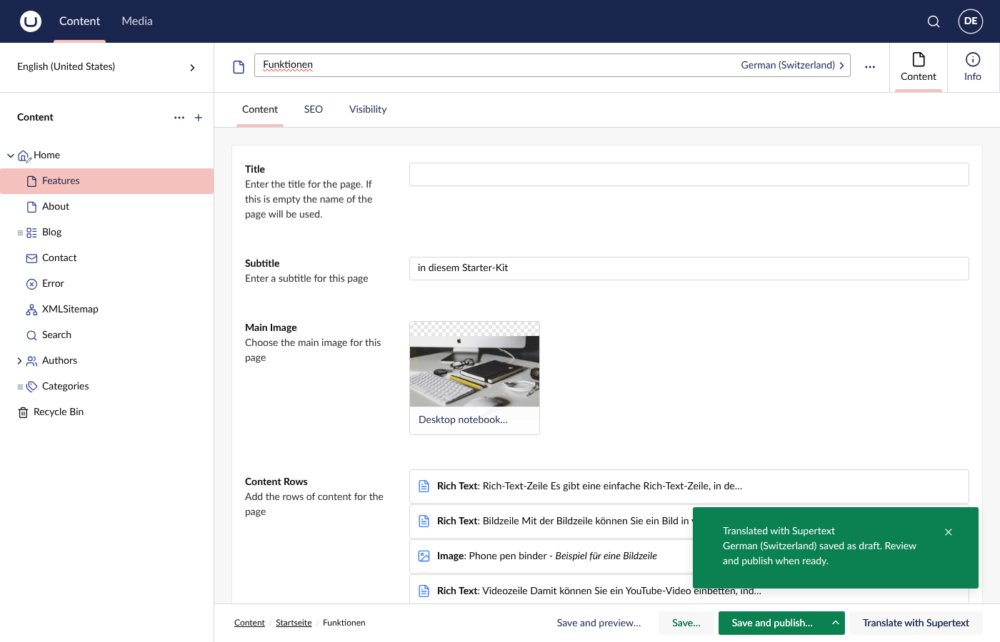
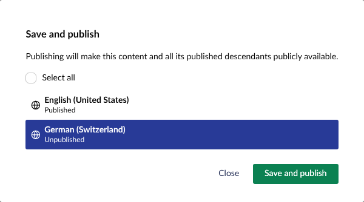
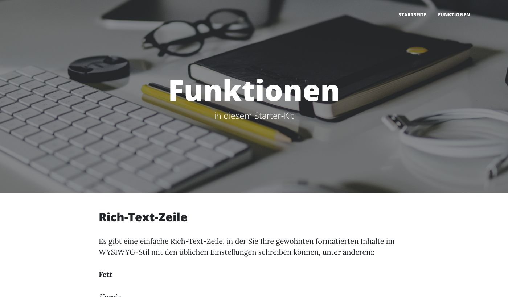
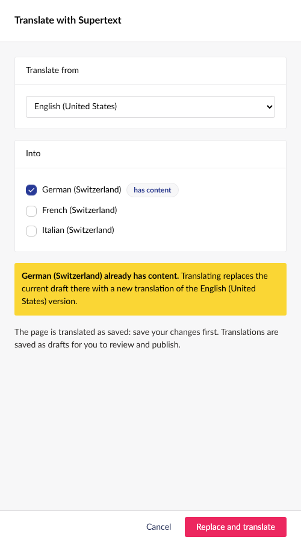

# User guide — Supertext Translation for Umbraco

For editors. Once an administrator has installed the package (see [INSTALLATION.md](INSTALLATION.md)), you translate a page with one button. Supertext writes the other language versions, and you review and publish them as usual.

The Supertext button, dialog and messages follow the interface language you chose in your Umbraco profile (English, German, French or Italian). The screenshots show the English interface.

## Translate a page

1. Open the page in the **Content** section. Save your changes first: the page is translated as saved.
2. Click **Translate with Supertext** next to *Save and publish*. (It's also in the page's *Actions* menu, ⋯, in the tree and in the header.)

   

3. Choose the language to translate **from** (usually the default language) and the languages to translate **into**. Languages the page doesn't exist in yet are preselected.

   

4. Click **Translate**. Each language goes to Supertext as one request, typically a few seconds. A green message confirms which languages were saved:

   

## Review and publish

The translations are saved as **drafts**: visitors don't see them until you publish. Switch to a language in the language menu of the page header. Translated languages show the translated page name and *Unpublished*:

Read through the translation and correct anything you like:

Then **Save and publish** and choose the language:

Umbraco only gives a page a URL in a language when the pages above it are published in that language too. Translate and publish the **home page first**, then its subpages. The German page is then live, under `/de/`:

## Translating again

If a language already has content, the dialog marks it **has content**. Translating into it replaces its current draft with a fresh translation of the source language, so Supertext asks first:

Your published version stays online until you publish the new draft.

## What gets translated

- The page name. Umbraco derives the URL of the language version from it, e.g. *Funktionen* → `/de/funktionen/`.
- Text fields, text areas and rich text (formatting and links kept).
- Text inside **block list** and **block grid** blocks, including rich text blocks, captions and titles.
- Every field that varies by language is copied to the new language, so the page is complete. Images, links, toggles and other non-text fields are copied as they are.

## What is *not* translated

- Fields that are shared by all languages (they don't vary by culture). They show the same content in every language anyway.
- Web addresses, e-mail addresses and numbers on their own (e.g. a YouTube link).
- Fields your administrator excluded, e.g. code snippets.
- Block *settings* (layout options), media items (image alt texts are on the media item, not the page), dictionary items and tags.
- Later changes to the source page. The translation is a one-time copy; translate again to update it.

## Formal and informal language

Your administrator decides per language whether Supertext writes formally (*Sie*, *vous*, *Lei*) or informally (*du*, *tu*). On the Supertext demo, German, French and Italian are formal.

## When something goes wrong

| Message | What it means |
| --- | --- |
| *No Supertext API key is configured* | The package isn't set up yet. Ask your administrator; the message links to the Supertext signup and API key pages they need. |
| *Supertext translation failed — German (Switzerland): …* | That language couldn't be translated (network, quota, Supertext unavailable). Nothing was changed for it; the other languages are still saved. Try again later. |
| *The document type … does not vary by culture* | This kind of page has only one version for all languages. Your administrator can enable *Vary by culture* for it. |
| You don't see the button | You need permission to update the page. Ask your administrator. |
